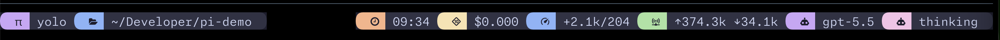

# pi-catppuccin-footer

A configurable [Pi](https://pi.dev) extension that replaces the default footer with a Catppuccin/tmux-style status line.


<details>
<summary>Default Pi footer</summary>



</details>

It is inspired by `tmux-catppuccin` modules and a lualine-style Neovim setup: rounded powerline caps, Catppuccin colors, configurable left/right sections, and live session stats.

## Features

- Catppuccin flavors: `mocha`, `macchiato`, `frappe`, `latte`
- tmux-style connected status modules
- configurable left/right section order
- project-local config via `.pi/catppuccin-footer.json`
- auto-reloads config changes
- preserves Pi extension statuses
- shows optional:
  - current directory
  - git branch
  - git dirty counts
  - Pi activity state
  - model name / aliases
  - total tokens
  - last-turn tokens
  - session cost
  - time
  - thinking level

## Install from npm

```bash
pi install npm:pi-catppuccin-footer
```

Then reload Pi:

```txt
/reload
```

## Install locally while developing

From this repo:

```bash
pi install ./path/to/pi-catppuccin-footer
```

Or load the extension for one Pi run:

```bash
pi -e ./extensions/catppuccin-footer.ts
```

## Quick start

After installing, create a global config:

```txt
/catppuccin-footer init --global
```

Or create a project-local config that overrides the global config:

```txt
/catppuccin-footer init
```

If a config already exists and you want to replace it:

```txt
/catppuccin-footer init --global --force
/catppuccin-footer init --force
```

## Configuration

Global config:

```txt
~/.pi/agent/catppuccin-footer.json
```

Project-local override:

```txt
.pi/catppuccin-footer.json
```

Project config is merged on top of global config. Nested `colors` and `aliases` are merged too.

Example:

```json
{
	"flavor": "mocha",
	"enabled": true,
	"style": "tmux",
	"cwdStyle": "short",
	"left": ["mode", "cwd", "git", "gitDiff"],
	"right": ["status", "state", "model", "tokens", "lastTokens", "cost", "time"],
	"timeFormat": "HH:mm",
	"moduleSpacing": 0,
	"autoReload": true,
	"colors": {
		"mode": "mauve",
		"cwd": "blue",
		"git": "green",
		"gitDiff": "green",
		"status": "peach",
		"state": "pink",
		"model": "mauve",
		"tokens": "green",
		"lastTokens": "blue",
		"cost": "yellow",
		"time": "peach",
		"thinking": "pink"
	},
	"aliases": {
		"claude-sonnet-4-5": "sonnet",
		"gemini-2.5-pro": "gemini"
	},
	"statusItems": {
		"include": [],
		"exclude": []
	}
}
```

With `autoReload: true`, config edits are picked up automatically. You can also reload manually:

```txt
/catppuccin-footer reload
```

To see every command and configurable feature inside Pi:

```txt
/catppuccin-footer help
```

For a top-level interactive config menu:

```txt
/catppuccin-footer edit
```

You can also turn sections on/off from Pi without editing JSON:

```txt
/catppuccin-footer section                          # open an interactive section picker
/catppuccin-footer sections edit                    # same interactive picker
/catppuccin-footer sections                         # show enabled/disabled sections
/catppuccin-footer section off status               # hide plugin/extension status items
/catppuccin-footer section on status right           # show status items on the right
/catppuccin-footer section toggle thinking left      # toggle thinking level on the left
/catppuccin-footer section off lastTokens --global   # write to the global config
```

Inline section changes are written to `.pi/catppuccin-footer.json` by default, or to the global config with `--global`.

You can also filter individual plugin/extension status items without hiding the whole `status` section:

```txt
/catppuccin-footer status                         # interactive status item picker
/catppuccin-footer status list                    # show current include/exclude filters
/catppuccin-footer status hide browser            # hide a status item by key or text
/catppuccin-footer status show browser            # unhide it
/catppuccin-footer status only memctx             # allow-list just matching status items
/catppuccin-footer status include 'browser*'      # add an allow-list pattern
/catppuccin-footer status reset                   # clear all status filters
```

Status patterns match the item key, text, or `key:text`, case-insensitively. `*` wildcards are supported. Exclude rules always win over include rules. Empty `include` means “show all non-excluded status items”; non-empty `include` means allow-list mode.

## Sections

Use these names in `left` and `right` arrays:

| Section      | Meaning                                   |
| ------------ | ----------------------------------------- |
| `mode`       | Pi/Yolo mode anchor                       |
| `cwd`        | Current working directory                 |
| `git`        | Current git branch                        |
| `gitDiff`    | Git dirty counts (`+`, `~`, `-`)          |
| `status`     | Pi plugin/extension status items          |
| `state`      | Pi activity state: idle/thinking/tools    |
| `model`      | Active model, with optional aliases       |
| `tokens`     | Total session input/output tokens         |
| `lastTokens` | Latest assistant turn input/output tokens |
| `cost`       | Total session cost                        |
| `time`       | Local time                                |
| `thinking`   | Current thinking level                    |

## Styles

```json
"style": "tmux"
```

Available styles:

- `tmux` — connected tmux-catppuccin-style modules
- `twoTone` — connected lualine-style two-tone group
- `bubble` — standalone rounded bubbles

## Colors

Available color names:

```txt
mauve
blue
green
yellow
peach
pink
surface
muted
text
```

## Commands

```txt
/catppuccin-footer              # toggle on/off
/catppuccin-footer on           # enable
/catppuccin-footer off          # disable
/catppuccin-footer reload       # reload config
/catppuccin-footer edit         # top-level interactive config menu
/catppuccin-footer help         # list all commands and configurable features
/catppuccin-footer sections     # show enabled/disabled sections
/catppuccin-footer section      # interactive section picker
/catppuccin-footer sections edit [--global]
/catppuccin-footer section on <section> [left|right] [--global]
/catppuccin-footer section off <section> [--global]
/catppuccin-footer section toggle <section> [left|right] [--global]
/catppuccin-footer status      # interactive status item picker
/catppuccin-footer status list
/catppuccin-footer status hide|show|only|include|exclude|reset [pattern] [--global]
/catppuccin-footer init --global         # write default global config
/catppuccin-footer init --global --force # overwrite default global config
/catppuccin-footer init                  # write default project config
/catppuccin-footer init --force          # overwrite default project config
```

## Development

This repo includes local tooling for formatting, linting, typechecking, tests, and package verification.

```bash
npm install
npm run check
```

Or with `just`:

```bash
just ci
```

Or with `mise`:

```bash
mise run check
```

The test suite uses Vitest.

## Security

Pi extensions run with full system permissions. Review extensions before installing them.

## License

MIT
